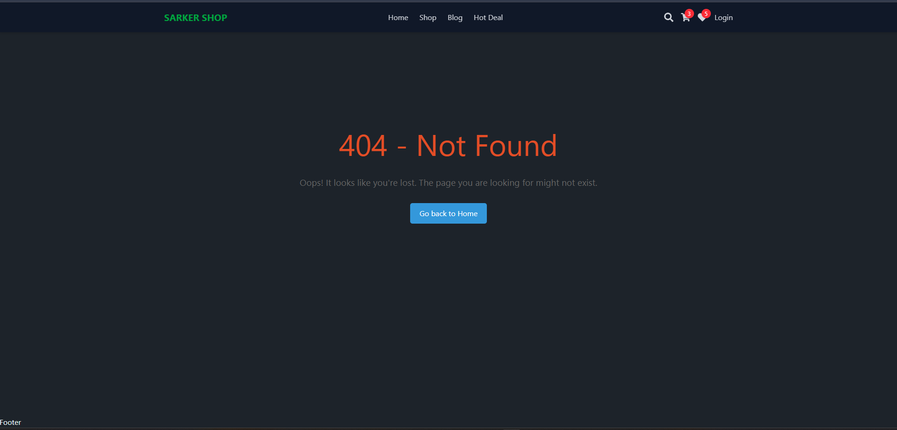

# SARKER SHOP - React Ecommerce Website

Welcome to SARKER SHOP, a modern and responsive e-commerce website built with React and Vite! This project aims to provide a seamless shopping experience with a clean user interface and fast performance.

## Features

*   **Responsive Design:** Fully responsive layout that adapts to different screen sizes.
*   **Product Listings:** Browse a wide range of products with detailed descriptions and images.
*   **Shopping Cart:** Add products to your cart and manage your selections easily.
*   **Wishlist:** Save your favorite items for later purchase.
*   **User Authentication:** Secure login and registration for personalized experience.
*   **Hot Deals:** Check out the latest promotions and discounts.
*   **Blog:** Stay updated with the latest news and trends.

## Preview




## Technologies Used

*   React
*   Vite
*   Tailwind CSS
*   React Icons

## Getting Started

### Prerequisites

*   Node.js (>=14.0)
*   npm or yarn

### Installation

1.  Clone the repository:

    ```bash
    git clone https://github.com/chayansrk64/react-tailwind-template.git
    cd react-tailwind-template
    ```

2.  Install dependencies:

    ```bash
    npm install
    # or
    yarn install
    ```

3.  Run the development server:

    ```bash
    npm run dev
    # or
    yarn dev
    ```

4.  Open your browser and navigate to `http://localhost:5173`.

## Expanding the Project

Feel free to contribute and expand this project. You can add features like:

*   Payment gateway integration
*   Advanced product filtering and sorting
*   User reviews and ratings
*   Order tracking

## License

[MIT](LICENSE)